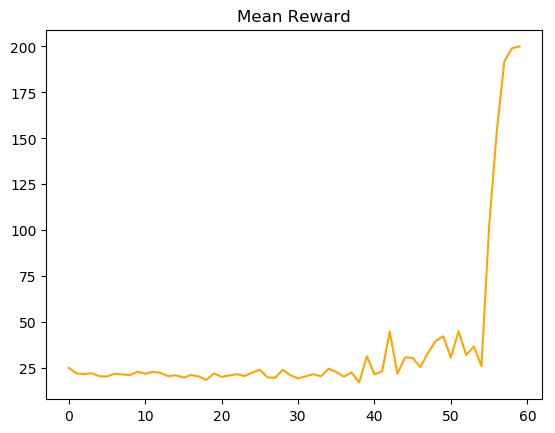
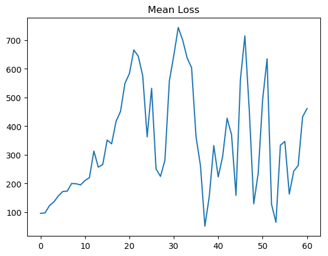

# CartPole - Reinforcement Learning
Aims to solve CartPole with various RL-Techniques at an intermediate level.

## Deterministic
- [X] Q-Tables
- [X] Deep Q Learning(Fixed Targets, Memory, Double-Q)
- [ ] Policy Gradient
- [ ] Actor Critic

Deep Q-Learning techniques will be mixed and tested.

# Results 
X-Axis = Epochs/100
Q = Standard Q-Learning, T = Fixed Targets, M = Memory, DQ = Double-Q

## Q-Tables - Input Discretized
Since discretization leads to reduced accuracy this problem cant be completely solved.
Finding a sweetspot between accuracy-tradeoff and value-conservation might lead to a solution.
Another way of solving this problem could be by broadening the observation-space(10^4 -> 10^8 / 9,999 -> 99,999,999).

  
   
  

## Q-Learning

  
   
  

## Q-Learning(Fixed Targets)
Epochs = 30000, Replacement-Interval = 2, γ = 0.92, Exploration = 20%, Learning-Rate = 0.00025
Unstable and performs poorly after there is no exploration or a high rewardmean is reached.
Reducing the update interval(to 5-1) helps but is pointless.
Can be solved by using a Learning-Rate scheduler.

  
   
  

## Q-Learning(Memory)

  
   
  

## Q-Learning(Fixed Targets, Memory)
Epochs = 30000, Replacement-Interval = 150, γ = 0.99, Exploration = 6%, Learning-Rate = 0.00025, Memorysize = 500, Batchsize = 8, Warmup-Steps = 150
Unstable and performs poorly after there is no exploration or a high rewardmean is reached.

  
   
  

## Q-Learning(Double Q)

  
   
  

## Q-Learning(Double Q, Memory)

  
   
  

## PolicyGradient

  
   

## Actor Critic

  
   

